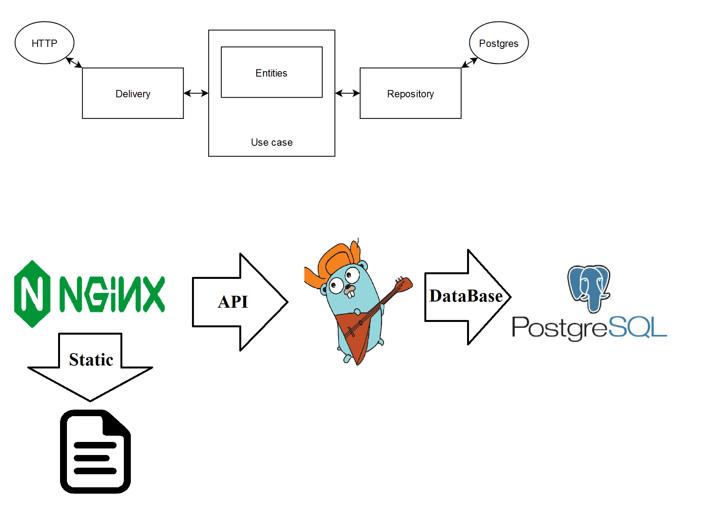
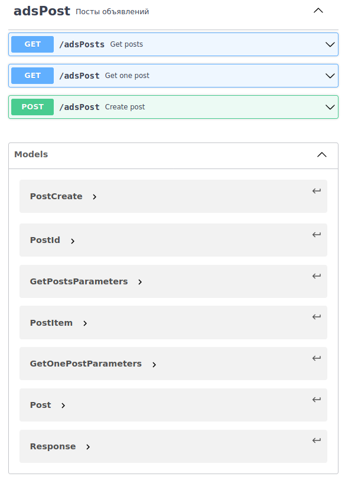

# Тестовое задание

Связь: telegram @Aleksey_Sir

Запуск: ```docker-compose up```

Заполнить объявлениями (100шт): ```sh ./build/postgres/fill_adsPosts_100.sh```

### Результаты
* Язык Go
* Хранение объявлений в Postgres
* Написаны тесты
* Есть описание архитектуры и документация
* Есть контейнеризация
* Есть логирование


### Описание работы

### Архитектура



### Документация

* Главная сущность - adsPost (advertising post)

* Сервис работает согласно заданию через JSON

* Все методы всегда возвращают структуру из кода, сообщения и тела с HTTP кодом 200.
Код в структуре показывает результат выполнения запроса, а сообщение
вспомогательную информацию. Данные ответа находятся в поле 'body'

* Опциональные поля в методе получения объявления должны быть уникальны

* При тестировании Repo используется "рабочая", а не тестовая БД. Перед тестами Repo
необходимо поднять контейнер. (!!!) После тестов база очищается. (!!!)

* Используется easyjson

* Модели, методы и допустимые значения описаны в Swagger


### Swagger файл: ```/readMeFiles/swagger.json```




### Примеры запросов


#### POST http://127.0.0.1:80/api/v1/adsPost

* ```http://127.0.0.1:80/api/v1/adsPost```


* Пример:
  ```{ "title":"some car name", "description":"it's cool car", "photos":["link_1", "link_2", "link_3"], "price":500000}```

  Ответ: ```{
  "body": {
  "id": 100
  },
  "code": 200,
  "msg": "OK"
  }```


* Пример 2, название больше 200:
  ```{"title":"some car name some car name some car name some car name some car name some car name some car name some car name some car name some car name some car name some car name some car name some car name some car name some car name some car name some car name some car name some car name some car name some car name","description":"it's cool car","photos":["link_1", "link_2", "link_3"],"price":500000}}```

  Ответ: ```{
  "body": null,
  "code": 400,
  "msg": "You need send title with [3, 200] length"
  }```


#### GET http://127.0.0.1:80/api/v1/adsPost

* ```http://127.0.0.1:80/api/v1/adsPost```


* Пример:
  ```{"id":100,"fields":["photos", "description"]}```

  Ответ: ```{
  "body": {
  "id": 100,
  "title": "some car name",
  "description": "it's cool car",
  "photos": [
  "link_1",
  "link_2",
  "link_3"
  ],
  "price": 500000,
  "date": "11:06:38 20-06-2021"
  },
  "code": 200,
  "msg": "OK"
  }```


* Пример 2, недопустимое опциональное поле:
  ```{"id":100,"fields":["bad field name", "description"]}```  
  
  Ответ: ```{
  "body": null,
  "code": 400,
  "msg": "Bad requested fields"
  }```


#### GET http://127.0.0.1:80/api/v1/adsPosts

* ```http://127.0.0.1:80/api/v1/adsPosts```

* Пример:
  ```{"start":0,"count":10,"sort":"date","desc":false}}```

  Ответ: ```"body": [
  {
  "id": 1,
  "title": "cat__101",
  "photo": "link_1",
  "price": 100500
  },
  {
  "id": 2,
  "title": "cat__102",
  "photo": "link_1",
  "price": 100500
  }...
  ],
  "code": 200,
  "msg": "OK"
  }```