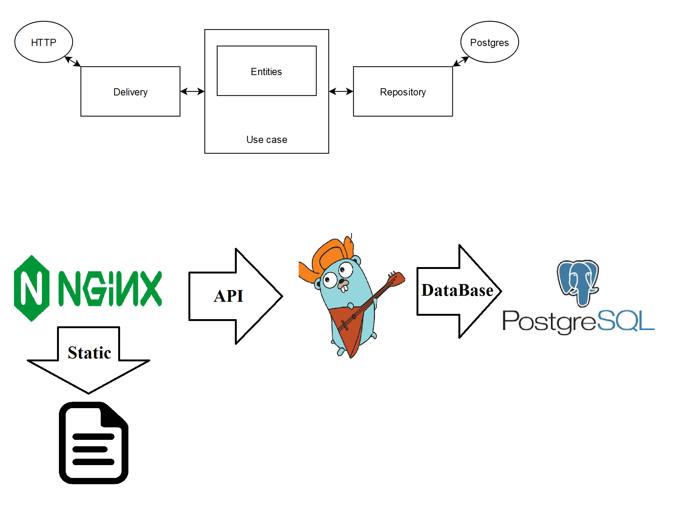
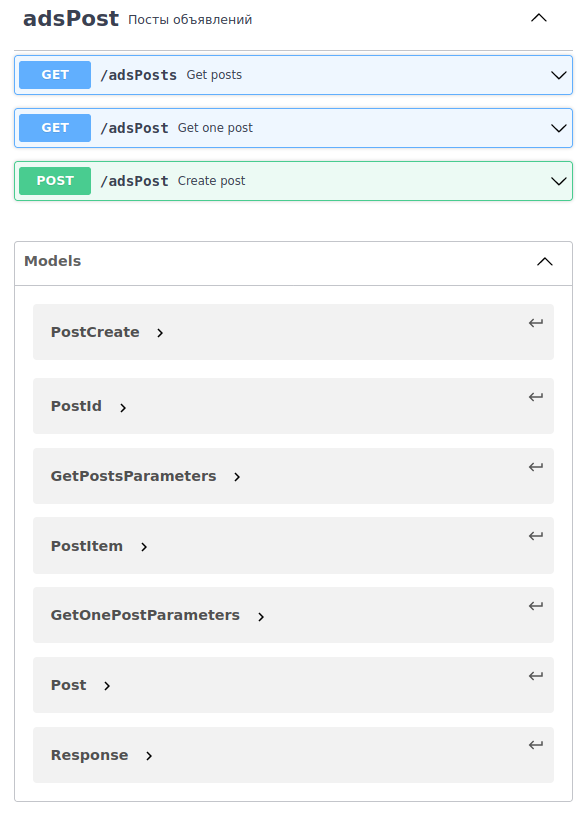

# Тестовое задание

Связь: telegram @Aleksey_Sir

Запуск: ```docker-compose up```

Заполнить объявлениями (100шт): ```sh ./build/postgres/fill_adsPosts_100.sh```

### Результаты
* Язык Go
* Хранение объявлений в Postgres
* Написаны тесты
* Есть описание архитектуры и документация
* Есть контейнеризация


### Описание работы

### Архитектура



### Документация

По заданию необходимо работать через JSON, но я бы не отправлял GET
запросы с телом, а использовал бы GET параметры
(Id объявления, поля сортировки и тд.).

Все методы всегда возвращают структуру из кода, сообщения и тела с HTTP кодом 200.
Код в структуре показывает результат выполнения запроса, а сообщение
вспомогательную информацию. Данные ответа находятся в поле 'body'.

Опциональный поля в методе получения объявления должны быть уникальны.

Модели и методы описаны в Swagger.


### Swagger файл: ```/readMeFiles/swagger.json```



